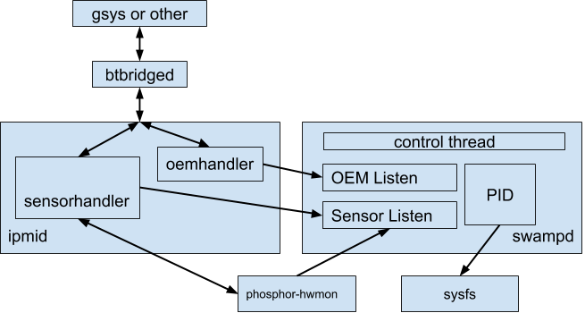

# phosphor-pid-control

This is a daemon running within the OpenBMC environment. It uses a well-defined
configuration file to control the temperature of the tray components to keep
them within operating conditions. It may require coordination with host-side
tooling and OpenBMC.

## Overview

The BMC will run a daemon that controls the fans by pre-defined zones. The
application will use thermal control, such that each defined zone is kept within
a range and adjusted based on thermal information provided from locally readable
sensors as well as host-provided information over an IPMI OEM command.

A system (or tray) will be broken out into one or more zones, specified via
configuration files or dbus. Each zone will contain at least one fan and at
least one temperature sensor and some device margins. The sensor data can be
provided via sysfs, dbus, or through IPMI. In either case, default margins
should be provided in case of failure or other unknown situation.

The system will run a control loop for each zone with the attempt to maintain
the temperature within that zone within the margin for the devices specified.

## Configuring

[How to configure phosphor-pid-control](configure.md)

## Detailed Design

The software will run as a multi-threaded daemon that runs a control loop for
each zone, and has a master thread which listens for dbus messages. Each zone
will require at least one fan that it exclusively controls, however, zones can
share temperature sensors.



In this figure the communications channels between swampd and ipmid and
phosphor-hwmon are laid out.

### Zone Specification

A configuration file will need to exist for each board.

Each zone must have at least one fan that it exclusively controls. Each zone
must have at least one temperature sensor, but they may be shared.

The internal thermometers specified can be read via sysfs or dbus.

### Chassis Delta

Due to data center requirements, the delta between the outgoing air temperature
and the environmental air temperature must be no greater than 15C.

### IPMI Access to Phosphor-pid-control

[OEM-IPMI Definitions](ipmid.md)

#### Set Sensor Value

Tools needs to update the thermal controller with information not necessarily
available to the BMC. This will comprise of a list of temperature (or margin?)
sensors that are updated by the set sensor command. Because they don't represent
real sensors in the system, the set sensor handler can simply broadcast the
update as a properties update on dbus when it receives the command over IPMI.

#### Set Fan PWM

A tool can override a specific fan's PWM when we implement the set sensor IPMI
command pathway.

#### Get Fan Tach

A tool can read fan_tach through the normal IPMI interface presently exported
for sensors.

### Sensor Update Loop

The plan is to listen for fan_tach updates for each fan in a background thread.
This will receive an update from phosphor-hwmon each time it updates any sensor
it cares about.

By default phosphor-hwmon reads each sensor in turn and then sleeps for 1
second. We'll be updating phosphor-hwmon to sleep for a shorter period -- how
short though is still TBD. We'll also be updating phosphor-hwmon to support pwm
as a target.

### Thermal Control Loops

Each zone will require a control loop that monitors the associated thermals and
controls the fan(s). The EC PID loop is designed to hit the fans 10 times per
second to drive them to the desired value and read the sensors once per second.
We'll be receiving sensor updates with such regularly, however, at present it
takes ~0.13s to read all 8 fans. Which can't be read constantly without bringing
the system to its knees -- in that all CPU cycles would be spent reading the
fans. TBD on how frequently we'll be reading the fan sensors and the impact this
will have.

### Main Thread

The main thread will manage the other threads, and process the initial
configuration files. It will also register a dbus handler for the OEM message.

### Enabling Logging & Tuning

By default, swampd won't log information. To enable logging pass "-l" on the
command line with a parameter that is the folder into which to write the logs.

The log files will be named `{folderpath}/zone_{zoneid}.log`.

To enable tuning, pass "-t" on the command line.

See [Logging & Tuning](tuning.md) for more information.

## Code Layout

The code is broken out into modules as follows:

*   `dbus` - Any read or write interface that uses dbus primarily.
*   `experiments` - Small execution paths that allow for fan examination
    including how quickly fans respond to changes.
*   `ipmi` - Manual control for any zone is handled by receiving an IPMI
    message. This holds the ipmid provider for receiving those messages and
    sending them onto swampd.
*   `notimpl` - These are read-only and write-only interface implementations
    that can be dropped into a pluggable sensor to make it complete.
*   `pid` - This contains all the PID associated code, including the zone
    definition, controller definition, and the PID computational code.
*   `scripts` - This contains the scripts that convert YAML into C++.
*   `sensors` - This contains a couple of sensor types including the pluggable
    sensor's definition. It also holds the sensor manager.
*   `sysfs` - This contains code that reads from or writes to sysfs.
*   `threads` - Most of swampd's threads run in this method where there's just a
    dbus bus that we manage.

## Example System Configurations

### Two Margin Sensors Into Three Fans (Non-Step PID)

```
A single zone system where multiple margin thermal sensors are fed into one PID
that generates the output RPM for a set of fans controlled by one PID.

margin sensors as input to thermal pid

fleeting0+---->+-------+    +-------+     Thermal PID sampled
               |  min()+--->+  PID  |     slower rate.
fleeting1+---->+-------+    +---+---+
                                |
                                |
                                | RPM setpoint
                    Current RPM v
                             +--+-----+
  The Fan PID        fan0+--->        |  New PWM  +-->fan0
  samples at a               |        |           |
  faster rate        fan1+--->  PID   +---------->--->fan1
  speeding up the            |        |           |
  fans.              fan2+--->        |           +-->fan2
                       ^     +--------+                +
                       |                               |
                       +-------------------------------+
                              RPM updated by PWM.
```
